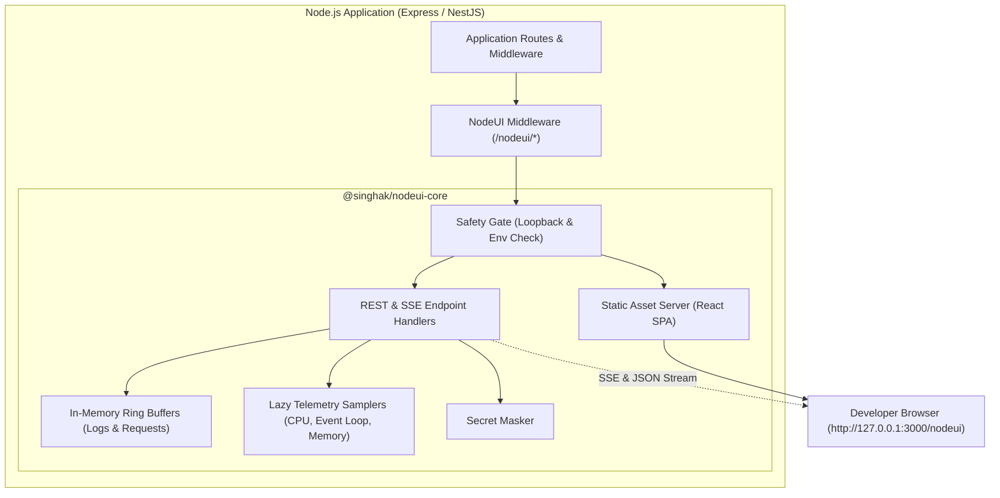

<div align="center">

# ⚡ NodeUI

### **The Local-Only Developer Console & Observability Suite for Node.js**

*An embedded, zero-cost developer dashboard for Express and NestJS — inspired by Spring Boot Admin & Quarkus Dev UI.*

<br/>

[](https://www.npmjs.com/package/@singhak/nodeui-express)
[](LICENSE)
[](https://nodejs.org)
[](https://www.typescriptlang.org/)
[](https://expressjs.com)
[](CONTRIBUTING.md)

<br/>

[**Quickstart**](#-quickstart) •
[**Key Features**](#-key-features) •
[**Framework Setup**](#-framework-integrations) •
[**Panels**](#-interactive-panels) •
[**Architecture**](#-architecture) •
[**Safety Model**](#-security--safety-model) •
[**Configuration**](#-configuration) •
[**FAQ**](#-faq--troubleshooting)

</div>

---

## 🎯 Overview

Spring Boot has **BootUI** and Quarkus has **Dev UI**, but Node.js developers have long had to stitch together `node --inspect`, Chrome DevTools, `clinic.js`, and ad-hoc `console.log` statements.

**NodeUI** fills that whitespace:
- 📦 **Embedded**: Bundled React UI + REST/SSE telemetry endpoints mounted directly inside your existing HTTP app.
- 🚀 **Zero Frontend Setup**: No external servers, no cloud telemetry, no docker containers to spin up.
- 🔒 **Local & Secure**: Loopback-only by default, automatic secret masking, and strict fail-closed safety in production.
- ⚡ **Zero-Overhead**: Lazy samplers that sleep when idle, and non-blocking in-memory ring buffers.

---

## ✨ Key Features

```
┌─────────────────────────────────────────────────────────────────────────────┐
│                                 NodeUI Hub                                  │
├──────────────────────┬──────────────────────┬───────────────────────────────┤
│ 🩺 Live Health & CPU │ 📈 Real-time Traffic │ 📸 V8 Heap Snapshots          │
│ Uptime, RSS, heap,   │ Latency distribution │ On-demand heap capture with   │
│ event-loop lag ms    │ RPS & error rates    │ 1-click single-use nonces     │
├──────────────────────┼──────────────────────┼───────────────────────────────┤
│ 🛣️ Route Discovery   │ 🔐 Secret Masking    │ 📜 Console Interception       │
│ Auto-scanned Express │ Redacts tokens, keys │ In-memory ring buffer of      │
│ & NestJS router tree │ passwords in all API │ live logs with level filters  │
└──────────────────────┴──────────────────────┴───────────────────────────────┘
```

- **📊 10 Built-in Telemetry Providers**: Memory, CPU, Event-loop lag, Health, HTTP Requests, Routes, Logs, Environment, Startup Timeline, and Heap Snapshots.
- **⚡ Server-Sent Events (SSE)**: Live streaming metrics directly to sparkline charts.
- **🛡️ Production Fail-Closed**: Automatically disabled in `NODE_ENV=production` unless explicitly overridden.
- **⏱️ Startup Profiling**: Mark and measure critical initialization phases with `server.mark('label')`.

---

## 📦 Packages in Monorepo

| Package | Version | Description |
| :--- | :--- | :--- |
| [`@singhak/nodeui-core`](packages/core) | `v0.2.2` | Framework-neutral observability engine, REST/SSE provider registry, static SPA server. |
| [`@singhak/nodeui-express`](packages/express) | `v0.2.2` | Middleware adapter for Express applications. |
| [`@singhak/nodeui-nestjs`](packages/nestjs) | `v0.2.2` | Dynamic module adapter for NestJS applications. |
| [`apps/ui`](apps/ui) | — | React + Vite single-page console embedded into core static build. |
| [`apps/demo-express`](apps/demo-express) | — | Sandbox Express verification server. |
| [`apps/demo-nestjs`](apps/demo-nestjs) | — | Sandbox NestJS verification server. |

---

## 🚀 Quickstart

Run the built-in demo playgrounds in under a minute:

```bash
# Clone and install
git clone https://github.com/Singhak/nodeui.git
cd nodeui
npm install
npm run build

# Start Express Demo -> Open http://127.0.0.1:3000/nodeui
npm run demo:express

# OR Start NestJS Demo -> Open http://127.0.0.1:3001/nodeui
npm run demo:nestjs
```

---

## 💻 Framework Integrations

### 1. Express

```bash
npm install @singhak/nodeui-express
```

```typescript
import express from 'express';
import { nodeui } from '@singhak/nodeui-express';

const app = express();

// Initialize NodeUI
const { middleware, server } = nodeui({
  path: '/nodeui', // Optional: defaults to /nodeui
});

app.use(middleware);

app.get('/api/users', (req, res) => {
  res.json({ users: ['Alice', 'Bob'] });
});

app.listen(3000, '127.0.0.1', () => {
  // Record startup mark for the Startup Timeline panel
  server.mark('listening');
  console.log('🚀 Server listening at http://127.0.0.1:3000');
  console.log('📊 NodeUI Dashboard at http://127.0.0.1:3000/nodeui');
});
```

---

### 2. NestJS

```bash
npm install @singhak/nodeui-nestjs
```

```typescript
import { Module } from '@nestjs/common';
import { NodeUIModule } from '@singhak/nodeui-nestjs';

@Module({
  imports: [
    NodeUIModule.register({
      path: '/nodeui',
      maskSecrets: true,
    }),
  ],
})
export class AppModule {}
```

---

## 🖥️ Interactive Panels

| Panel | Icon | Metric / Capability | Details |
| :--- | :---: | :--- | :--- |
| **Health** | 🩺 | System state & uptime | Shows `ok`/`degraded`/`critical`, Node.js version, PID, uptime, and current lag. |
| **Memory** | 🧠 | Heap & RSS telemetry | Visualizes Heap used, Heap total, RSS, External memory, and system-level RAM with live sparklines. |
| **CPU** | ⚡ | Process utilization | Tracks User CPU %, System CPU %, and aggregate process CPU load over time. |
| **Event Loop** | ⏱️ | Lag sampling | Monitors event-loop execution delay (current, peak max, average). |
| **Heap Snapshot** | 📸 | Memory leak inspection | One-click trigger for V8 `.heapsnapshot` generation protected by single-use nonces. |
| **Requests** | 🌐 | Traffic & Latency | Live HTTP metrics: request rates, status breakdown, latency histogram, and request ring buffer. |
| **Routes** | 🛣️ | Router introspection | Automatic discovery of declared routes, HTTP verbs, paths, and controller handler names. |
| **Logs** | 📜 | Console capture | Real-time stream of `console.log`, `info`, `warn`, `error` with search and log level filters. |
| **Environment** | 🔐 | Configuration auditor | Inspects `process.env` and custom configs with automatic secret redaction. |
| **Startup** | ⏳ | Boot profiling | Visual sequence diagram of initialization timestamps and `server.mark()` milestones. |

---

## 🏗️ Architecture

NodeUI embeds seamlessly into your application pipeline without external processes:



---

## 🔒 Security & Safety Model

> [!IMPORTANT]
> NodeUI is engineered specifically for **local development environments**. A suite of built-in safeguards prevents accidental production exposure.

- **🚫 Fail-Closed in Production**: NodeUI turns completely off when `NODE_ENV=production` unless explicitly forced via `NODEUI_ENABLED=true`.
- **🏠 Loopback Binding Only**: Incoming requests from non-loopback addresses (`!127.0.0.1` and `!::1`) are immediately rejected with `403 Forbidden`.
- **🛡️ Aggressive Secret Redaction**: Values of environment keys or config properties matching patterns such as `TOKEN`, `KEY`, `SECRET`, `PASSWORD`, `CREDENTIAL`, or `AUTH` are replaced with `[REDACTED]`.
- **🔑 Nonce-Gated Mutating Actions**: Heavy operations like V8 Heap Snapshots require a two-step challenge: request a single-use confirmation nonce via `POST /confirmations`, then submit with `x-nodeui-confirm` header.
- **⚡ Zero Overhead When Disabled**: When inactive, the middleware is a direct, zero-overhead `next()` passthrough without active event listeners or timers.

---

## ⚙️ Configuration

### Programmatic Options

Passed to `nodeui(options)` or `NodeUIModule.register(options)`:

| Option | Type | Default | Description |
| :--- | :--- | :--- | :--- |
| `path` | `string` | `'/nodeui'` | Base route prefix where console UI and API are mounted. |
| `host` | `string` | `'127.0.0.1'` | Allowed host interface for incoming requests. |
| `enabled` | `boolean` | `env-based` | Explicitly enable (`true`) or disable (`false`) console. |
| `maskSecrets` | `boolean` | `true` | Automatically redact sensitive environment and config values. |
| `requestLogSize` | `number` | `500` | In-memory capacity for HTTP request logs. |
| `logSize` | `number` | `500` | In-memory capacity for captured console messages. |
| `pollIntervalMs` | `number` | `2000` | Sampler collection interval for CPU and event-loop lag. |
| `inactivityTimeoutMs`| `number` | `60000` | Idling timeout before background samplers pause. |
| `confirmTtlMs` | `number` | `60000` | Expiration window for mutation confirmation nonces. |
| `heapSnapshotDir` | `string` | `os.tmpdir()` | Destination directory where `.heapsnapshot` files are written. |
| `config` | `object \| fn` | `undefined` | Custom metadata object or getter to display in the Environment panel. |

### Environment Variables

| Variable | Default | Purpose |
| :--- | :--- | :--- |
| `NODEUI_ENABLED` | `unset` | Set to `true` to force-enable (or `false` to force-disable). |
| `NODEUI_PATH` | `/nodeui` | Prefix for web UI and API. |
| `NODEUI_HOST` | `127.0.0.1` | Loopback address validation target. |
| `NODEUI_POLL_INTERVAL_MS` | `2000` | Polling sampling rate in milliseconds. |
| `NODEUI_INACTIVITY_TIMEOUT_MS`| `60000` | Inactivity timer before providers stop background polling. |
| `NODEUI_REQUEST_LOG_SIZE` | `500` | Capacity of the request circular buffer. |
| `NODEUI_LOG_SIZE` | `500` | Capacity of the console log circular buffer. |
| `NODEUI_CONFIRM_TTL_MS` | `60000` | Nonce validity duration. |
| `NODEUI_HEAP_SNAPSHOT_DIR` | `os.tmpdir()` | Snapshot output directory. |

---

## 📡 REST & SSE API Reference

All JSON endpoints return an envelope format:
```json
{
  "ok": true,
  "data": { ... }
}
```

| Method | Endpoint | Description |
| :--- | :--- | :--- |
| `GET` | `/api/health` | Overall health state, PID, uptime, Node version, and current lag. |
| `GET` | `/api/memory` | Process memory stats (RSS, heapUsed, heapTotal, external). |
| `GET` | `/api/cpu` | Process CPU percentages (total, user, system). |
| `GET` | `/api/event-loop` | Current, maximum, and average event-loop lag times. |
| `GET` | `/api/requests` | Recent HTTP traffic buffer and aggregate metrics. |
| `GET` | `/api/routes` | Introspected Express / NestJS router map. |
| `GET` | `/api/logs` | Captured console logs buffer with timestamp and level. |
| `GET` | `/api/env` | Masked environment variables and app configurations. |
| `GET` | `/api/startup` | Startup timeline marks registered via `server.mark()`. |
| `GET` | `/api/live` | **Server-Sent Events (SSE)** real-time metric stream. |
| `POST`| `/api/confirmations` | Issues a single-use cryptographic token for mutating actions. |
| `POST`| `/api/heap-snapshot` | Takes a V8 heap snapshot (requires `x-nodeui-confirm` header). |

---

## 📊 Benchmarks & Performance

Synthetic latency and throughput overhead testing (`scripts/bench.mjs`, Node 22, Express 5, 5,000 requests per scenario):

| Scenario | Mean Latency | p50 | p95 | p99 | Throughput |
| :--- | :---: | :---: | :---: | :---: | :---: |
| **Baseline** *(No NodeUI)* | `4.12 ms` | `3.53 ms` | `7.55 ms` | `12.66 ms` | `243 rps` |
| **NodeUI Enabled** *(Recording active)* | `3.92 ms` | `3.44 ms` | `7.93 ms` | `13.11 ms` | `255 rps` |
| **NodeUI Disabled** *(Fail-closed)* | `3.12 ms` | `2.84 ms` | `3.84 ms` | `8.33 ms` | `321 rps` |

> [!TIP]
> Memory and CPU overhead are practically negligible under typical development and local staging workloads.

---

## ❓ FAQ / Troubleshooting

<details>
<summary><b>Why is the console only reachable from my local machine?</b></summary>
<br/>
By default, NodeUI binds strictly to <code>127.0.0.1</code> and rejects non-loopback requests with <code>403 Forbidden</code>. This is a crucial security barrier so sensitive runtime data and heap snapshots are never exposed to local networks or the public internet. If you need remote access for internal teams, place an authenticated reverse proxy in front of the application.
</details>

<details>
<summary><b>Why does the Routes panel show "No Express router captured yet"?</b></summary>
<br/>
NodeUI discovers routes lazily upon receiving the first request through the app router. Trigger any request against your backend API endpoints, then refresh the NodeUI dashboard.
</details>

<details>
<summary><b>How do I forward custom logger messages (Winston, Pino) to NodeUI?</b></summary>
<br/>
NodeUI automatically captures native <code>console.log/info/warn/error</code>. For external loggers, use the provided helper method on the server instance:
<pre><code class="language-ts">server.addLogSource({ level: 'info', message: 'User logged in successfully' });
</code></pre>
</details>

<details>
<summary><b>Why are my environment variables showing as <code>[REDACTED]</code>?</b></summary>
<br/>
Keys containing terms like <code>KEY</code>, <code>SECRET</code>, <code>TOKEN</code>, <code>PASSWORD</code>, or <code>AUTH</code> are automatically masked for safety. You can disable masking by passing <code>maskSecrets: false</code> in your configuration options.
</details>

<details>
<summary><b>How does heap snapshot capture work with confirmation nonces?</b></summary>
<br/>
Capturing heap snapshots is a mutating action. When triggered from the UI, a confirmation modal automatically requests a single-use nonce from <code>POST /nodeui/api/confirmations</code> and passes it in the <code>x-nodeui-confirm</code> header to <code>POST /nodeui/api/heap-snapshot</code>.
</details>

---

## 🛠️ Development & Monorepo Scripts

```bash
npm install              # Install all workspace dependencies
npm run build            # Build core -> adapters -> UI bundle
npm run test             # Run Vitest test suites across all packages
npm run typecheck        # Run TypeScript typechecks
npm run lint             # Lint with ESLint
npm run format           # Format code with Prettier
npm run bench            # Run middleware performance benchmark
npm run demo:express     # Launch Express sandbox app
npm run demo:nestjs      # Launch NestJS sandbox app
```

See [CONTRIBUTING.md](CONTRIBUTING.md) for full contribution conventions and [SECURITY.md](SECURITY.md) for our security reporting policy.

---

## 📄 License

Distributed under the **Apache-2.0 License**. See [LICENSE](LICENSE) for more details.

<div align="center">
<sub>Built with ❤️ for the Node.js developer community.</sub>
</div>
